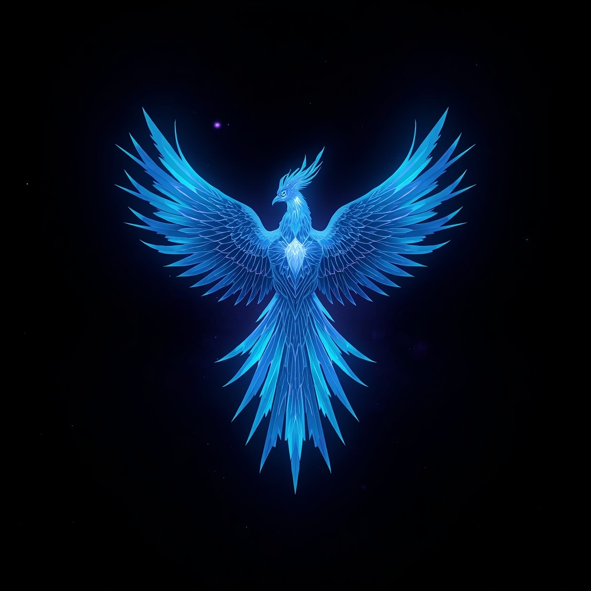
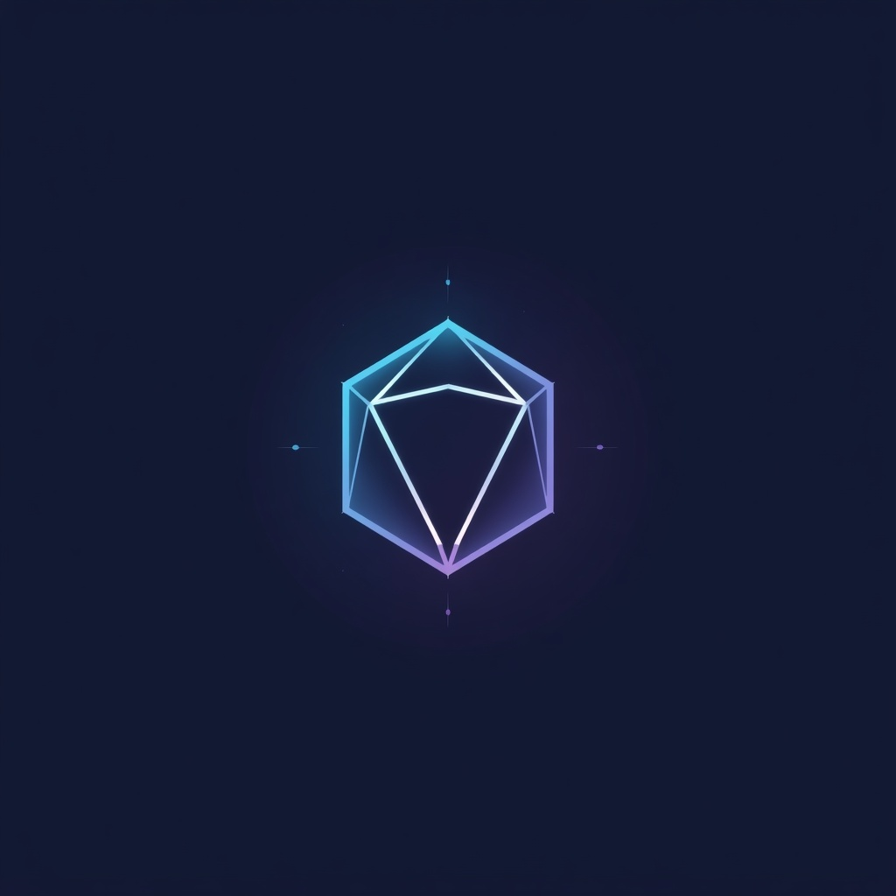

# NFT Gallery

Projeto desenvolvido para a atividade **Portfólio 1.0**, com o objetivo de criar uma galeria de NFTs utilizando HTML, CSS, Git e GitHub.

## Sobre o projeto

O projeto foi desenvolvido em três fases, começando com a criação de um card de NFT e evoluindo para uma galeria com vários cards e um cabeçalho responsivo.

### Fase 1.0 — NFT Preview Card

- Criação do card de NFT
- Design baseado no desafio do Frontend Mentor
- Efeito de hover
- Informações sobre o NFT
- Layout responsivo

### Fase 1.1 — CardList

- Criação de uma lista com três cards de NFT
- Diferentes imagens e informações
- Imagens geradas utilizando Leonardo AI
- Animações utilizando Animate.css
- Efeitos de hover
- Layout responsivo para diferentes tamanhos de tela

### Fase 1.2 — Header

- Criação de um cabeçalho responsivo
- Logo personalizada criada utilizando Leonardo AI
- Menu de navegação
- Efeitos de hover
- Animação de entrada
- Seção sobre a coleção
- Melhorias no design geral da página

## Funcionalidades

- Galeria com três NFTs
- Design responsivo
- Menu de navegação
- Animações de entrada
- Efeitos de hover
- Efeito de zoom nas imagens
- Seção "About the Collection"
- Layout adaptado para computador, tablet e celular

## Tecnologias utilizadas

- HTML5
- CSS3
- Animate.css
- Git
- GitHub
- Leonardo AI

## Imagens

As imagens dos NFTs e a logo do projeto foram criadas utilizando Leonardo AI.

### NFT Collection

### Logo

## Referências

- Frontend Mentor — NFT Preview Card Component
- Animate.css
- Leonardo AI

## Autora

**Ana Julia**

GitHub: [anajuliabvv](https://github.com/anajuliabvv)